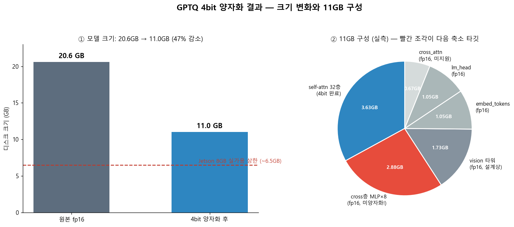
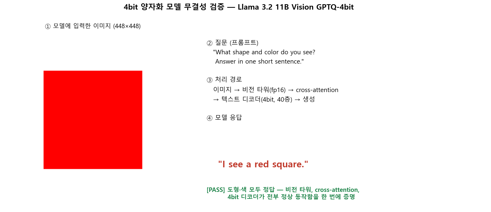
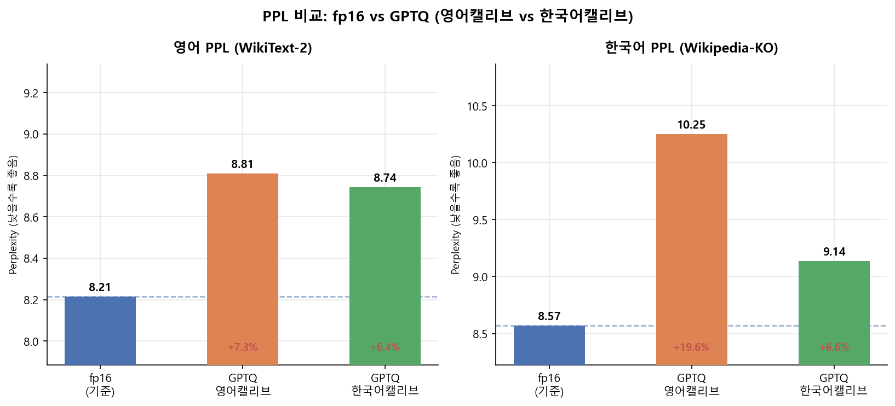
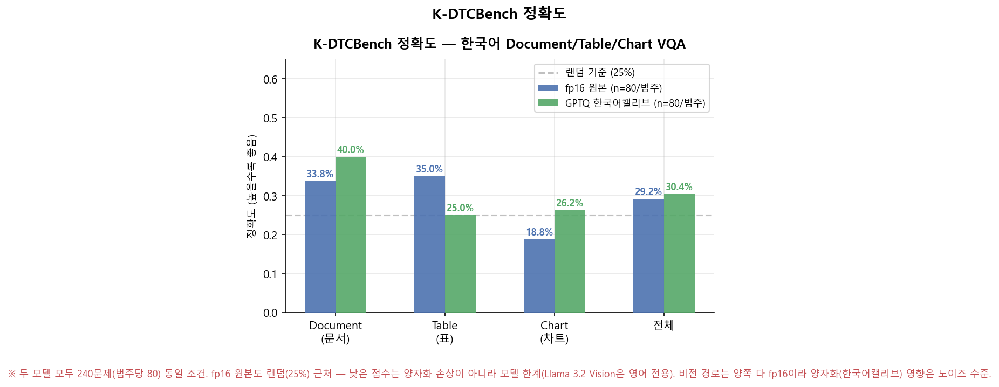
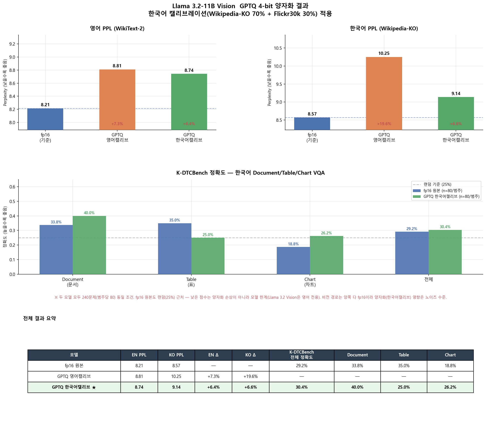

# llama32-vlm-gptq

Llama 3.2 11B Vision(Instruct) 모델을 **GPTQ 4비트**로 양자화하고, 최종적으로 **Jetson Orin Nano**에 올리는 과정 진행 중,.

> 왜 GPTQ인가 (vs AWQ/SpinQuant): [docs/quantization_method_selection.md](docs/quantization_method_selection.md)

## 단계

- **Phase 1 (현재): 데스크톱 양자화 + 검증**
  - RTX 3080 Ti(12GB)에서 GPTQModel로 레이어 단위 4비트 양자화
  - 양자화 전/후 정확도·VRAM·속도 비교
- **Phase 2 (후속): Jetson Orin Nano 이식**
  - `scripts/jetson/` 참고. 8GB 적재 가능성 / mllama 런타임은 별도 검증 필요

## 비교 설계 (중요)


1. **순수 양자화 검증** (핵심): `11B fp16` vs `11B 4bit` — **같은 모델**이라 점수
   차이 = 순수 양자화 효과. fp16은 22GB라 Jetson엔 못 올리므로 **정확도는
   데스크톱에서** 측정(정확도는 하드웨어 무관), Jetson엔 4bit만 올려 VRAM·속도 측정.
2. **엣지 배포 참고선**: `SmolVLM2-2.2B`(무양자화) — "큰 모델 양자화 vs 작은 모델
   네이티브"용 **별도 참고선**. 양자화 기준표가 아님(다른 모델이라 양자화 효과를
   분리 못 함). 회의록의 "같은 계열 작은 모델"이 이쪽.

> GPTQModel의 mllama 지원은 **텍스트 레이어 한정** → 캘리브는 텍스트(list[str])로
> 충분하고, 비전 타워는 fp16으로(Jetson VRAM 계산에 반영).

## 환경

| 항목 | 값 |
|------|-----|
| GPU | NVIDIA RTX 3080 Ti, 12GB |
| CUDA | 12.6 (드라이버 560.94) |
| 시스템 RAM | 64GB (CPU 오프로드용으로 충분) |
| Python | **3.11 권장** (3.13은 gptqmodel/torch 휠 미지원 가능성) |

> 12GB VRAM으로는 11B Vision(fp16 ~22GB)을 통째로 못 올리지만, GPTQModel이
> 레이어 단위로 양자화하고 나머지는 CPU(RAM)로 오프로드하므로 동작 가능.

## 설치

```powershell
# Python 3.11 가상환경 생성
py -3.11 -m venv .venv
.\.venv\Scripts\Activate.ps1

# 나머지 먼저 → CUDA torch는 "맨 마지막"에 설치
# (gptqmodel 7.x가 torch>=2.8 CPU 빌드를 끌어오므로, CUDA 빌드로 마지막에 덮어써야 함)
pip install --upgrade pip
pip install -r requirements.txt
pip install torch torchvision --index-url https://download.pytorch.org/whl/cu126 --force-reinstall
```

> 드라이버 560.94(CUDA 12.6) 기준 `cu126` 사용. `pip install` 순서를 바꾸면
> torch가 CPU 빌드로 덮여 `torch.cuda.is_available()==False` 가 되니 주의.

## 모델 접근 (필수)

`meta-llama/Llama-3.2-11B-Vision-Instruct`는 **gated 모델**

1. https://huggingface.co/meta-llama/Llama-3.2-11B-Vision-Instruct 에서 라이선스 승인
2. HF 액세스 토큰 발급 후 `.env`에 설정 (`.env.example` 복사)

## 실행

```powershell
python src/download_model.py     # 1. 원본 모델 다운로드
python src/quantize.py           # 2. GPTQ 4비트 양자화
python src/evaluate.py           # 3. 전/후 비교
```

세부 설정은 `configs/gptq_config.yaml` 에서 조정.

## 실험 결과 (Phase 1)

### 1. 압축 & 무결성

| | fp16 원본 | GPTQ 4bit |
|---|---|---|
| 디스크 크기 | 20.6GB | **11.0GB (−47%)** |




컴포넌트별로 보면 self-attn 32층(3.63GB)만 4bit화됐고, 나머지 절반(비전 타워·cross-attn MLP·임베딩·lm_head, 약 7.4GB)은 GPTQModel의 mllama 지원이 텍스트 레이어 한정이라 **fp16 그대로 남음** — 이 부분이 나중에 Jetson 8GB 적재의 발목을 잡는다(아래 4번 참고).

무결성 검증(빨간 사각형 이미지 + "무슨 도형/색?" 질문)은 PASS — 비전 타워·cross-attention·4bit 디코더가 정상 동작함을 한 번에 확인.

### 2. PPL 비교 — 캘리브레이션 언어의 영향



| | fp16 | GPTQ 영어캘리브 | GPTQ 한국어캘리브 |
|---|---|---|---|
| 영어 PPL (WikiText-2) | 8.21 | 8.81 (+7.3%) | 8.74 (+6.4%) |
| 한국어 PPL (Wikipedia-KO) | 8.57 | 10.25 (+19.6%) | **9.14 (+6.6%)** |

영어 캘리브레이션만 쓰면 한국어 경로가 "안 쓰임"으로 분류돼 더 거칠게 양자화된다(Δ+19.6%). 캘리브를 한국어 위키(70%) + Flickr30k 영어(30%) 혼합으로 바꾸자 한국어 손상도가 영어와 비슷한 수준(+6.6%)까지 균형을 회복.

### 3. K-DTCBench — 한국어 문서/표/차트 VQA (240문제)



| | fp16 원본 | GPTQ 한국어캘리브 |
|---|---|---|
| 전체 정확도 | 29.2% | 30.4% |
| Document | 33.8% | 40.0% |
| Table | 35.0% | 25.0% |
| Chart | 18.8% | 26.2% |

둘 다 랜덤(25%) ±6%p 이내 — 점수 차이는 표본 노이즈다. 낮은 점수 자체도 양자화 손상이 아니라 **모델 한계**(Llama 3.2 Vision은 영어 전용이라 한국어 문서 이해가 원래 약함)로 판단. 비전 경로(cross-attn+vision)는 두 모델 다 fp16이라, 텍스트 캘리브가 이 벤치마크 점수에 미치는 영향은 미미하다.

### 4. Jetson 8GB 적재 압축 시도 — 3bit / depth pruning (둘 다 목표 미달)


- **3bit 재양자화**: 11.0GB → 10.1GB(−0.9GB뿐), 대신 한국어 PPL 9.14 → 12.64(+47%). 텍스트 비트만 더 낮춰도 fp16 비전 경로가 그대로라 크기는 거의 안 줄고 품질만 나빠지는 나쁜 거래.
- **Depth pruning (ShortGPT, 힐링 없음)**: self-attn 2층 드롭이 한계(+28%), 4층부터 사용 불가(PPL 24.9), 8층은 붕괴(PPL 1393).

결론: one-shot 압축(양자화 비트 축소 또는 프루닝)만으로는 8GB 미달. Phase 2에서 비전/cross-attn 양자화(멀티모달 캘리브) + 프루닝 후 LoRA 힐링 + sub-4bit(AQLM/QuIP#) 조합이 필요.

### 전체 요약


