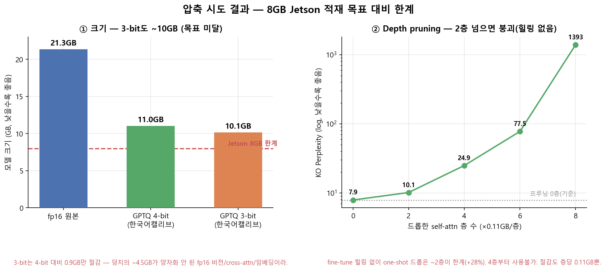

# Llama 3.2 11B Vision 4bit 경량화 (GPTQ / NF4)

**Llama-3.2-11B-Vision-Instruct**를 4bit로 경량화해 **Jetson Orin Nano(8GB)** 적재를 노리는 프로젝트.
데스크톱(RTX 3080 Ti 12GB)에서 양자화·품질 검증을 완료했고, Jetson 이식이 다음 단계다.

> 왜 GPTQ인가 (vs AWQ/SpinQuant): [docs/quantization_method_selection.md](docs/quantization_method_selection.md)

## 핵심 결과 요약

| 구성 | 한국어 PPL (Δ vs fp16) | K-DTCBench | Peak VRAM |
|------|------------------------|-----------|-----------|
| fp16 (원본) | 8.57 | 29.2% | ~22GB |
| GPTQ 4bit (영어 캘리브) | 10.25 (+19.6%) | 35.4% | ~11GB |
| GPTQ 4bit (한국어 혼합 캘리브 70/30) | 9.14 (+6.6%) | 30.4% | ~11GB |
| **NF4 전체 4bit (비전 포함)** | 9.23 (+7.7%) | 37.9% | **8.15GB** |
| NF4 + lm_head 4bit + 타일2 | 9.33 (+8.9%) | 32.5% | **6.88GB** |

- **영어로만 캘리브하면 한국어 PPL이 +19.6% 손상** → 한국어 혼합 캘리브로 +6.6%까지 회복. GPTQ 캘리브 데이터의 언어 구성이 실제로 중요하다.
- GPTQ(GPTQModel)는 mllama의 **텍스트 레이어만** 양자화 → 비전 경로 ~4.5GB가 fp16으로 남아 8GB 미달. **bitsandbytes NF4로 비전 인코더·cross-attn 포함 전체 4bit** 적재 시 캘리브 없이도 GPTQ 동급 품질에 3GB를 더 아낀다 (NF4는 데이터-프리라 언어 편향 자체가 없음).
- K-DTCBench(240문제) 점수는 전 구성이 랜덤(25%) 부근 노이즈 — 이 모델의 한국어 문서 이해 한계이며, 양자화로 인한 추가 손상은 없다는 것까지만 해석.

## 추가 압축 손잡이 (NF4 기준)

lm_head 4bit(`nf4_lmhead`)와 이미지 타일 수 축소(`--max-tiles`)의 조합 매트릭스 (K-DTCBench 정확도 / peak VRAM):

| | 타일 4 (기본) | 타일 2 | 타일 1 |
|---|---|---|---|
| nf4 | 37.9% / 8.15GB | 35.0% / 7.66GB | 23.3% / 7.44GB |
| nf4_lmhead | 35.0% / 7.37GB | **32.5% / 6.88GB** | 23.3% / 6.66GB |

- **타일 1은 붕괴**(23.3%, 랜덤 이하) — 문서 읽기 불가, 채택 불가.
- lm_head 4bit·타일 2는 각각 −2.9pt 수준으로 노이즈 범위 내 = 실질 무해. 속도 보너스 306s→224s.
- **현실적 최선: `nf4_lmhead` + 타일 2 = 6.88GB.** 최대 압축(타일 1)도 6.66GB로 6.5GB 목표엔 미달 — 나머지 ~0.4GB는 KV캐시/활성값/경량 프루닝 몫.

### 기각된 경로 — sub-4bit / depth pruning



- **3bit GPTQ**: 11.0GB → 10.1GB(−0.9GB뿐)에 한국어 PPL +47% — 나쁜 거래.
- **Depth pruning (ShortGPT, 힐링 없음)**: self-attn 2층 드롭이 한계, 4층부터 사용 불가(PPL 24.9).
- sub-4bit로 가야 한다면 그때 MBQ식 모달리티-인지 캘리브 구현이 필요 (4bit에선 캘리브 이득이 작아 불필요).

## 비교 설계

1. **순수 양자화 검증**: `11B fp16` vs `11B 4bit` — 같은 모델이라 점수 차이 = 순수 양자화 효과. 정확도는 데스크톱에서 측정(하드웨어 무관), Jetson엔 4bit만 올려 VRAM·속도 측정.
2. **엣지 배포 참고선**: `SmolVLM2-2.2B`(무양자화) — "큰 모델 양자화 vs 작은 모델 네이티브" 비교용 별도 참고선.

## 환경

| 항목 | 값 |
|------|-----|
| GPU | NVIDIA RTX 3080 Ti, 12GB |
| CUDA | 12.6 (드라이버 560.94) |
| 시스템 RAM | 64GB (CPU 오프로드용) |
| Python | **3.11 권장** (3.13은 gptqmodel/torch 휠 미지원 가능성) |

> 12GB VRAM으로 11B fp16(~22GB)은 못 올리지만, GPTQModel이 레이어 단위로 양자화하며 나머지를 RAM으로 오프로드하므로 동작한다.

## 설치

```powershell
# Python 3.11 가상환경 생성
py -3.11 -m venv .venv
.\.venv\Scripts\Activate.ps1

# 나머지 먼저 → CUDA torch는 "맨 마지막"에 설치
# (gptqmodel 7.x가 torch>=2.8 CPU 빌드를 끌어오므로, CUDA 빌드로 마지막에 덮어써야 함)
pip install --upgrade pip
pip install -r requirements.txt
pip install torch torchvision --index-url https://download.pytorch.org/whl/cu126 --force-reinstall
```

> `pip install` 순서를 바꾸면 torch가 CPU 빌드로 덮여 `torch.cuda.is_available()==False`가 되니 주의.

## 모델 접근 (필수)

`meta-llama/Llama-3.2-11B-Vision-Instruct`는 **gated 모델**.

1. https://huggingface.co/meta-llama/Llama-3.2-11B-Vision-Instruct 에서 라이선스 승인
2. HF 액세스 토큰 발급 후 `.env`에 설정 (`.env.example` 복사)

## 실행

### 양자화 파이프라인 (GPTQ)

```powershell
python src/download_model.py     # 1. 원본 모델 다운로드
python src/quantize.py           # 2. GPTQ 4비트 양자화 (한국어 혼합 캘리브)
python src/evaluate.py           # 3. 전/후 비교
```

세부 설정은 `configs/gptq_config.yaml`. NF4는 별도 양자화 단계가 없다 — 평가 스크립트가 로드 시 즉석 양자화한다.

### 평가

```powershell
# K-DTCBench (한국어 문서/표/차트 VQA, 240문제)
python src/eval_kdtcbench.py --model nf4_lmhead --max-tiles 2
#   --model  fp16 | gptq | nf4 | nf4_lmhead
#   --max-tiles N  이미지 타일 상한 축소 (기본 4)
#   --prune-k K    Block Influence 순 self-attn K층 드롭 (실험용)

# Perplexity (영어/한국어)
python src/eval_ppl.py --model nf4_lmhead
```

결과는 `results/*.json`으로 저장.

## 다음 단계 — Jetson 이식

- `scripts/jetson/` 참고. `nf4_lmhead` 체크포인트(디스크 6.42GB, bnb config 내장)를 이관해 `from_pretrained`로 바로 4bit 로드, 타일 축소는 로드 후 `shrink_max_tiles()` 런타임 패치.
- 확인 필요: bitsandbytes aarch64(Jetson) 지원 여부, 가중치 외 KV캐시/활성값 ~0.4GB 확보.
